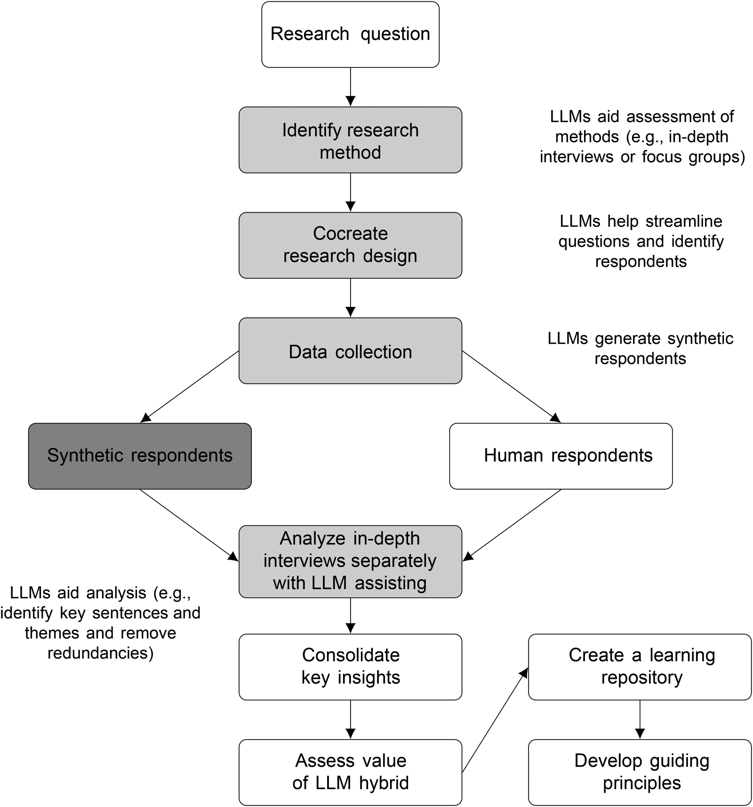
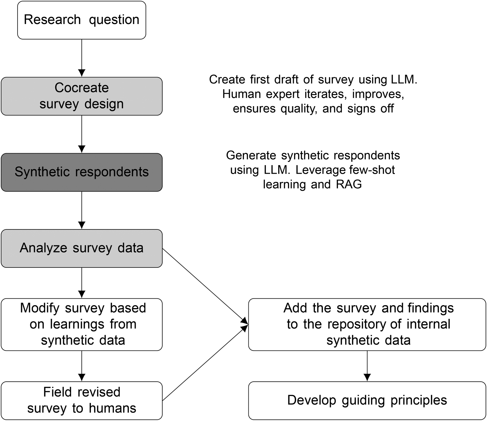

# AI 驱动的品牌建设工作流

[](./LICENSE)

一个 AI 驱动的品牌建设平台：五个工作坊从界定 SBU 出发，依次完成目标市场选择、品牌价值主张提炼与营销组合规划，最终汇成一份完整的品牌策划书；方法上融合 LLM 合成调研、Delphi 专家权重、LDA 主题建模与最优决策扇面。

## 方法依据

Arora、Chakraborty 与 Nishimura 于 2025 年在《Journal of Marketing》发表《AI-Human Hybrids for Marketing Research: Leveraging Large Language Models (LLMs) as Collaborators》。作者们与一家财富 500 强食品企业合作，用 GPT-4 复现该公司 2019 年的定性深访与定量概念测试（n=605，以原始人类研究为基准），实验分定性、定量两条线，都以原始人类研究为基准逐项对照。

### 论文方法与实验过程

定性侧（Study 1）复现的是 2019 年围绕 Friendsgiving（朋友间庆祝的感恩节）的线上深访：讨论提纲保持不变，按“谁选样本 / 谁当受访者 / 谁来追问”组合出四种人机混合条件：
- 混合 1 依原受访者画像（性别、年龄、族裔、主人或宾客角色）生成合成受访者；
- 混合 2 让 LLM 先建议该研究该访谈谁（补上了原研究漏掉的饮食限制者、留学生与外籍人士、LGBTQ+ 群体、开发 Friendsgiving 菜单的厨师），再据此生成 10 个 persona；
- 混合 3 让 LLM 既当受访者又当主持，对每轮问答按清晰度 / 相关性 / 深度 / 洞察性四维实时打分（0–100），低于 80 分自动追问、再打分，达标才进下一题；
- 混合 4 是混合 2 与混合 3 的叠加，既按 LLM 建议重新生成 persona，又由 LLM 兼任受访者与主持并自动追问。

评估有四层指标：
- NLP 指标（可读性、信息密度、LDA 主题一致性）；
- BERT 句向量降维后与人类数据的语义距离；
- Prolific 上 250 名评估者的盲评；
- 专家评委对摘要的盲选。
混合 3 在前两层指标上表现最好，后续评估以它的数据为准。作者们从每段问答的受访者回答中挑出最关键、最能代表观点的句子（划重点），在这个环境中人类分析师平均每段挑出 35 句，LLM 只挑出 19 句，但双方各自挑出的句子平均余弦相似度达 .78，说明他们认为是重点的句子高度重合。摘要环节由 10 名五年以上经验的分析师与 LLM 分别完成“划重点—聚类主题—写摘要”的流程，共有 20 份摘要，交由 5 名十年以上经验的评委逐题盲选。结果显示：人类评估者认为 LLM 回答的深度与洞察性分别高出约 0.68 与 0.50 分（五点量表）；LLM 分析师主题召回率达 77%–96%，还能发现人类遗漏的新主题；专家评选最佳摘要时没有任何一位选择纯人类或纯 LLM 的版本。

**Source:** [1]


定量侧（Study 2）复现的是 2019 年冷藏狗粮概念测试（605 名狗主）：概念为可重封袋 vs 可切片管两种包装 × fresh 与 human grade 两种食材，测量概念偏好、购买可能性 / 喜爱 / 独特性、7 项态度李克特题与 9 档购买频次。作者用 GPT-4 按原样本人口特征逐人生成 605 个合成受访者（304 人评可重封袋、301 人评可切片管），比较三种上下文注入：
- LLM1 零样本，仅 persona 和题目；
- LLM2 few-shot，把同一受访者已答的前几题问答对拼进系统提示；
- LLM3 few-shot 结合 RAG，把公司此前一项高档宠物食品定性研究中 16 名受访者的转录做成向量库，按题检索注入，以均值偏差、异质性差和内部一致性差衡量合成数据与人类数据的差距。

复现结果如下：
- 零样本（LLM1）为 .66 / .41 / .40。均值方向抓得住（变量均值偏高则合成均值偏高、偏低则偏低），但回答挤在 4–5 分、态度题间相关几乎为零（人类数据中“最健康配料”与“最高品质”相关 .69）；
- 加 few-shot 后异质性与相关差降到 .29 / .27，再加 RAG 后相关差降到 .11、最贴近人类的相关结构；
- 三者的均值偏差仍在 .66–.69，几乎没有改善。
论文由此得出三点核心结论：人机混合优于任何单边；LLM 可以低成本扮演合成受访者、访谈主持与分析师；零样本合成回答能抓住方向（均值高低趋势），但异质性与内部一致性不足，需要用 few-shot 与 RAG 注入上下文改善。

**Source:** [1]


### 参考文献

[1] N. Arora, I. Chakraborty, and Y. Nishimura, “AI–Human Hybrids for Marketing Research: Leveraging Large Language Models (LLMs) as Collaborators,” *Journal of Marketing*, vol. 89, no. 2, pp. 43–70, 2025, doi: 10.1177/00222429241276529.

### 基于论文的工作流设计

| 论文机制 | 本项目的模仿设计 |
| --- | --- |
| 混合 1：按受访者画像生成合成受访者 | Work1「合成调研」把客户画像当作受访者，用李克特 5 点题作答（题目由指标体系生成或手动添加），实测均值回填指标分；每位画像可重复 n 轮（少量 / 标准 / 丰富三档），控制样本量与异质性 |
| 混合 2：先让 LLM 建议“该听谁”，再生成 persona | Work2「Hybrid 2 Delphi」先由 AI 招聘“该听哪 5 个视角”，再为每个视角并行生成带 keySignals 的深 persona 并独立赋权；每个 persona 的提示词含 few-shot 示例与相关材料（RAG） |
| 混合 3：LLM 受访者 + 自动追问的主持 | 受访者角色照做——画像作答 + JSON schema 校验 + 错误反馈重试；主持人角色交给用户——问卷题目、调研密度、Few-shot 与 RAG 开关都由人定，Work2 的分歧也由用户主持裁决。平台未实现自动追问 |
| LLM 分析师：划重点 → 聚类主题 → 写摘要 | Work1「数据分析」把调研数字压成可执行的综合洞察（可 AI 起草 / 自写）；Work3 对语料跑 LDA（连上后端时本地建模，否则由 LLM 模拟同构主题），再提炼痛点地图，证据摘录带 [真实] / [模拟] 来源 |
| Study 2 三档上下文注入：零样本 → few-shot → few-shot + RAG | Work1「合成调研」提供 Few-shot 开关与 RAG 参考资料粘贴框，配合每位画像重复轮数，把“注入上下文才能改善异质性”的结论做成可调参数 |
| 论文以真实人类研究为基准、不让合成数据冒充真人 | Work3 卖点挖掘采用“真实 + 模拟”双通道：真实语料（粘贴 / 导入 / Work1 开放题）与画像模拟语料分开存放，界面与导出都标注语料构成与来源；真实不足 3 条时模拟补足到可运行，真实足量时模拟默认仍参与、可勾选退出 |
| 结论：人机混合优于任何单边 | Work3 刻意保留混合而不是二选一：模拟语料默认参与建模，且默认包含负面 / 抱怨文本（支撑痛点证据）；所有 AI 产出都只作起草，由人工复核采纳 |
| 边界：LLM 会出错，研究设计与最终洞察由人负责 | 全平台 AI 起草、人工复核；未配置 API Key 时所有 AI 步骤自动降级为复制提示词手动模式，流程不依赖 AI 也能完整走通 |


本项目未复现论文的评估实验（无人类盲评、NLP 指标与句向量对照）；未实现混合 3 的自动追问，此外Delphi 采用单轮，不是多轮往返。模拟语料不能替代真实问卷与评论，只能作为参考资料进行辅助，在实际使用途中，使用者需要结合自身的经验与行业的现实情况进行审核与修改。

论文全文：`docs/AI-Human Hybrids for Marketing Research Leveraging Large Language Models (LLMs) as Collaborators.pdf`

## 架构

- **前端**（`docs/`）：`global-brand-building.html` 单页 + 5 个 `workshopN.js` 工作坊模块 + `lib/` 下 20 个原生 JS 工具模块（AI 上下文、JSON 容错解析、状态持久化、版本快照、任务锁等）。无框架、无构建步骤，浏览器直接加载。
- **案例库**（`docs/cases/`）：5 个演示案例，源数据按 `<brand>/work1-5.js + index.js` 组织，`bundle.js` 由 `scripts/build-cases-bundle.js` 生成，`loader.js` 是运行时注册表。
- **后端**（`server/`）：FastAPI，默认 `127.0.0.1:8765`。端点：健康检查 `/api/health`、配置读写 `/api/config`、状态 `/api/state`、版本快照 `/api/snapshots`（增删/改名/恢复）、LLM 代理 `/api/llm`、LDA `/api/lda`、表格解析 `/api/parse-excel`、文档提取 `/api/extract-doc`；同时托管前端静态文件。
- **配置与数据**：API 配置存 `server/config.yaml`，API Key 存 `server/.env`（均已 git-ignore）；工作内容存 `server/data/<project>/current.json`，版本快照存同目录 `snapshots/`。
- **LLM 请求代理**：所有 AI 调用经后端转发，API Key 不会到达浏览器；`providers.js` 维护各提供商 JSON 模式白名单，Gemini 的非 OpenAI 请求体由 `gemini_body.py` 转换。
- **分析与解析**：LDA 主题建模（jieba + gensim，`lda.py`）、八爪鱼/问卷星表格解析（pandas + openpyxl，`excel_parser.py`）（未测试）、文档文本提取（`doc_extract.py`：txt/md/csv 直接读、docx 用标准库解、pdf 用 pypdf）。
- **测试**：`tests/` 下 50+ 个 Node 直跑测试（`node tests/<name>.test.js`），另含 `server/test_lda.py`；仓库根执行 `node scripts/run-tests.js` 可顺序跑全部测试并汇总退出码。
- **安全回归**：`server/test_security.py` + `tests/security_frontend.test.js` 覆盖 API Key 不外泄、`project_id`/快照路径穿越、上传大小上限、Markdown/SVG 转义。

## 运行

### 1. 启动 Python 后端

```bash
cd server
python -m venv .venv
.venv\Scripts\activate        # Windows
# source .venv/bin/activate   # macOS/Linux
pip install -r requirements.txt
# 导出 PDF 需要 Chromium（首次安装后执行一次）
python -m playwright install chromium
python app.py
```

后端健康检查：<http://localhost:8765/api/health>

### 2. 打开工具

访问 <http://localhost:8765/>（HTML 与 JS 均由 FastAPI 提供）。后端未启动时页面会显示启动指引。

### 3. 配置 LLM

打开页面右上角“API 设定”（齿轮）：每家厂商一套独立配置（Base URL / Model / 自己的 API Key）。厂商下拉选中后自动预填该厂商官方 Base URL 与可用 Model（都可改），**“保存”= 写入该厂商并设为当前激活**——AI 调用走激活的那家，不存在"界面选 A、实际打 B"。

国内厂商已内置在“提供商”下拉里，已配 Key 的厂商带 ✓（预填值会随厂商迭代，README 与 `lib/providers.js` 同步维护）：

| 厂商 | Base URL | 预填 Model 示例 |
| --- | --- | --- |
| DeepSeek | `https://api.deepseek.com` | `deepseek-v4-flash` |
| 火山方舟 Agent plan | `https://ark.cn-beijing.volces.com/api/plan/v3` | `ark-code-latest` |
| Kimi（Moonshot） | `https://api.moonshot.cn/v1` | `kimi-k2.6` |
| MiniMax | `https://api.minimaxi.com/v1` | `MiniMax-M3` |
| 通义千问 | `https://dashscope.aliyuncs.com/compatible-mode` | `qwen3.6-flash` |
| 智谱 GLM | `https://open.bigmodel.cn/api/paas/v4` | `glm-5.3` |

下拉里另有 OpenAI / Google Gemini / 其他（任意 OpenAI 兼容端点，Base URL 留空手填）。结构化字段（Delphi 权重、JSON 回填等）对豆包/Kimi/MiniMax 走"提示词要求 JSON + 容错解析"路径（这些厂商对 `response_format` 参数历史上有 400，白名单保守置关）；若你的厂商支持 JSON 模式可自行在 `lib/providers.js` 调整。

非敏感配置（各家 Base URL / Model / 温度 / 当前激活家）存 `server/config.yaml`，各家 Key 分存 `server/.env` 的 `LLM_API_KEY_<厂商>` 行（均 git-ignore）。Key 输入框**留空 = 不动该家 Key**；已有 Key 时粘贴新 Key 保存会先确认覆盖；“清除此厂商 Key”按钮可单独删一家。某家未配 Key 时激活它 → AI 自动模式不可用（自动落手动），“测试连接”会如实失败，不会借别家 Key"假成功"。旧版单槽遗留的裸 `LLM_API_KEY` 不会被自动归属任何厂商（避免固化历史上 Key 与厂商错配），设置弹窗会提示你手动认领或丢弃。顶栏可随时在“API 自动 / 手动模式”间切换。

### 4. 一键跑测试

```bash
node scripts/run-tests.js
```

脚本会先按文件名顺序跑完 `tests/*.test.js`，再跑 `server/test_*.py`（使用 `server/.venv`）；任一失败都会继续跑完其余测试并在最后汇总，退出码非 0。后端依赖未安装时会明确提示而不是静默跳过。

## 工作坊

| # | 名称（步数） | 核心方法 |
|---|---|---|
| I | 业务价值体系（8 步） | SBU 界定（业务三问、边界声明）、PEST + 竞品 + 资源盘点、客户画像、指标体系（自评 vs 实测 Δ）、合成调研（AI-Human Hybrids, JM 2025）、Likert/开放题分析、Sheth 价值框架、建议 |
| II | 目标市场（3 步） | 4×2 指标模板、5 位合成专家 Delphi 赋权（LLM 招募视角 → 画像赋权 → 均值收敛）、加权评分、吸引力 × 竞争力矩阵、三档决策 |
| III | 价值主张（6 步） | 场景细分、语料导入（xlsx/csv/txt）+ LDA 主题建模（本地 Python；语料 = 真实 + 画像模拟混合，依据 JM 2025）、痛点地图、备选卖点、合意性 × 可实施性矩阵、最优决策扇面、迁移路径、定位句、MBTI 人格、slogan |
| IV | 营销组合（5 步） | 渠道路径、4P 表单与步级 AI 起草（每步一按钮整组回填）、渠道结构树、媒介预算百点图 |
| V | 策划书（1 步） | 5 章国标编号文档（业务与市场 / 环境分析 / 市场选择与定位 / 营销组合 / 总结与展望）、SWOT 2×2 与 4C 一键 AI 生成、4P 摘要表 + 预算横条图；导出 ▼ 统一入口（Markdown / 多选工作坊打印 PDF） |

## 数据、版本与导入导出

- **自动保存**：内容有改动时约每 2 分钟自动落盘；切换步骤/工作坊、刷新或关闭页面前会立即同步（sendBeacon）。关页面再打开，内容还在。
- **保存与版本**：顶栏“保存”弹出命名框，保存 = 持久化当前内容 + 建一个版本；留空则按时间命名。内容无变化不会新建版本。时间命名版本自动清理、只保留最近 10 个，手动命名版本永久保留。
- **历史记录**：右上角“历史记录”列出全部版本，可一键恢复（直接载入，不做额外备份）、重命名、删除。重置、导入 .md 前会自动建“重置前 / 导入前存档”版本，都可在历史记录中回退。
- **导入 / 导出**：顶栏「导出 ▼」统一菜单含「导出 Markdown」「打印 / PDF」两项。导出 Markdown 生成可阅读的 .md，文件末尾嵌入完整数据；文件名与首行标题由档案名决定（进入过某版本时顶栏显示当前档案名，可用 ✎ 重命名；无档案名时回退 `brand-workshop.md`）。“导入 .md”解析该数据块并覆盖当前内容，API 配置不会被导入。
- **打印 / PDF**：「打印 / PDF」打开多选面板，勾选要打印的工作坊（默认全不勾，至少勾一个才能打印；选中某坊即自动包含该坊全部步骤，按 I → V 输出）。打印产物为“内容成果版”：不含输入框 / 按钮 / MVO 卡等编辑骨架，保留已填内容、表格与 SVG 图表。
- **语料导入（Work III）**：卖点挖掘步可上传 xlsx / xls / csv / txt，经后端解析（`/api/parse-excel`）后进入 LDA 语料列表。
- **演示案例**：顶栏“演示案例”提供 5 个完整案例（豆芽妈妈、小镬记、问渠书院、恒锐造、毛孩子之家），覆盖母婴电商、餐饮、教培、B2B 制造、宠物服务等行业。进入即只读沙箱：进入前内容先存快照；浏览期间编辑控件与 AI 全部禁用、不写盘，顶栏「导出 ▼」同时禁用（案例内不提供 MD 导出与打印），顶栏按钮变“退出案例”，点击丢弃案例数据、恢复进入前的工作区。

## 写作辅助

- **本步最小可交付（MVO）**：每步顶部一张可勾选清单，告诉你这步至少要交什么。全部通过后，步骤底部亮出“下一步 →”按钮（工作坊末步则是跳往下一工作坊的跨坊 CTA）；清单只控制按钮显隐，步骤导航始终可用。
- **AI 任务锁**：全局同一时刻至多一个 AI 任务，进行中时其他 AI 按钮锁定。按钮三态：生成中 → 已暂停（再次点击主体 = 中止）→ 回到初始；生成中另有 × 直接中止，进度按 LLM 调用次数计。


## 目录

```
docs/
  global-brand-building.html           # 主页面（顶栏 + 5 个工作坊 + 各弹层）
  workshop1.js ... workshop5.js        # 各工作坊模块（步骤、渲染、AI 调用）
  workshop5-editorial.css              # Work V 策划书排版样式
  tokens.css                           # 设计 token（色板 / 字号 / 间距 / 动效）
  architecture.html                    # 架构图（可交互）
  cases/                               # 案例库
    loader.js                          #   运行时注册表（Cases.list / load）
    bundle.js                          #   由 scripts/build-cases-bundle.js 生成，勿手改
    <brand>/work1-5.js + index.js      #   5 个案例源数据
    SCHEMA.md                          #   案例数据结构说明
  lib/
    ai_context.js                      # 全局 AI 上下文（分节 digest + 消息设置）
    call_json_strict.js                # 带错误反馈重试的严格 JSON 调用
    json_extract.js                    # LLM JSON 多层容错解析
    schema_check.js                    # AI 输出结构校验
    likert_parse.js                    # 李克特 1-5 容错解析
    providers.js                       # 提供商 JSON 模式白名单
    archive.js                         # 版本（快照）存取
    runner.js                          # AI 任务全局锁（三态按钮 / 进度）
    backend.js                         # 本地服务 HTTP 适配器
    store.js                           # 状态持久化（保存 / 加载）
    schema_migrate.js                  # 旧数据迁移注册表
    markdown_exchange.js               # 导出/导入 .md 纯逻辑
    matrix_chart.js                    # 散点矩阵 / 条形图 SVG 渲染
    ui.js                              # 步骤挂载契约 + 共享 UI 组件
    settings.js                        # API 设定弹层
    savepanel.js                       # 保存弹层
    history.js                         # 历史版本弹层
    demomenu.js                        # 案例选择菜单
    export_menu.js                     # 「导出 ▼」菜单 + 多选工作坊内容成果版打印
    app.js                             # 应用编排（init / 导航 / 导出 / 案例切换）
  charts/ fonts/ pics/                 # 静态资源（图示 / 字体 / 截图）
server/
  app.py                               # FastAPI 入口（全部 /api/* 端点 + 静态托管）
  config.py                            # config.yaml + .env 读写
  llm_proxy.py / llm_validate.py / gemini_body.py
                                       # LLM 代理（转发 / 请求校验 / Gemini 请求体转换）
  storage.py                           # 状态持久化与版本快照
  lda.py                               # LDA 主题建模（jieba + gensim）
  excel_parser.py                      # 八爪鱼/问卷星表格解析
  doc_extract.py                       # docx/pdf/txt/md/csv 文本提取
  .env.example                         # API Key 模板
  requirements.txt
scripts/
  build-cases-bundle.js                # 重新生成 docs/cases/bundle.js
  run-tests.js                         # 顺序跑全部 JS/Python 测试并汇总退出码
tests/                                 # Node 直跑测试（node tests/<name>.test.js）
```

## 降级策略

- 未配置 API Key 或切到“手动模式”→ 所有“用 AI 生成”按钮变成“复制提示词 → 粘贴解析”卡片，流程不依赖 AI 也能完整走通。
- Work I 没跑合成调研 → Work III 合意性评分自动回退到 AI 直接打分（无逐 persona 子分）；有调研数据则回填各 persona 均值。
- 本地服务未连接 → LDA 主题改由 LLM 模拟生成；Excel/CSV 语料导入不可用。
- LLM 输出坏 JSON → `json_extract.js` 多层容错抢救（Markdown 表 / 智能引号 / 裸换行 / 截断修复）；仍失败时 `call_json_strict.js` 携错误反馈自动重试一次。
- 载入旧版本或旧结构数据 → `schema_migrate.js` 迁移注册表 + 各工作坊自愈逻辑（heal）自动补齐缺省字段，不丢内容。
